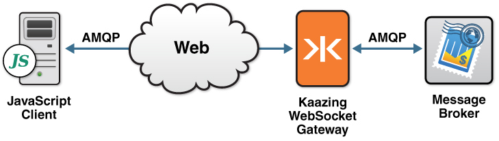

Build JavaScript AMQP Clients
=============================

**Note:** To use the Gateway, a KAAZING client library, or a KAAZING demo, fork the repository from [kaazing.org](http://kaazing.org).

This checklist provides the steps necessary to build AMQP clients to communicate with KAAZING Gateway:

| \#  | Step                                                                                                                                   | Topic or Reference                                                                       |
|-----|----------------------------------------------------------------------------------------------------------------------------------------|------------------------------------------------------------------------------------------|
| 1   | Learn about the KAAZING Gateway AMQP client.                                                                                      | [Overview of the KAAZING Gateway JavaScript AMQP Client Library](#overview-of-the-kaazing-gateway-javascript-amqp-client-library)          |
| 2   | Learn how to use the Gateway AMQP Client Library and the supported APIs.                                                            | [Use the KAAZING Gateway JavaScript AMQP Client Library](p_dev_js_client_amqp.md) |
| 3   | Learn how to authenticate your client by implementing a challenge handler to respond to authentication challenges from the Gateway. | [Secure Your JavaScript AMQP Client](p_dev_js_secure.md)                               |

Overview of AMQP 0-9-1
----------------------

Advanced Message Queuing Protocol (AMQP) is an open standard for messaging middleware that was originally designed by the financial services industry to provide an interoperable protocol for managing the flow of enterprise messages. To guarantee messaging interoperability, AMQP 0-9-1 defines both a wire-level protocol and a model—the AMQP Model—of messaging capabilities.

The AMQP Model defines three main components:

1.  *Exchange*: clients publish messages to an exchange
2.  *Queue*: clients read messages from a queue
3.  *Binding*: a mapping from an exchange to a queue

An AMQP client connects to an AMQP broker and opens a *channel*. Once the channel is established, the client can send messages to an exchange and receive messages from a queue. To learn more about AMQP functionality, take a look at the [Real-Time Interactive Guide to AMQP](../guide-amqp.md), an interactive guide that takes you step-by-step through the main features of AMQP version 0-9-1.

For more information about AMQP, visit [http://www.amqp.org](http://www.amqp.org).

WebSocket and AMQP
------------------

WebSocket enables direct communication from the browser to an AMQP broker. The Gateway JavaScript client library radically simplifies Web application design so Web developers can code directly against the back-end AMQP broker without the need for custom Servlets or server-side programming.

Overview of the KAAZING Gateway JavaScript AMQP Client Library
--------------------------------------------------------------

KAAZING Gateway AMQP JavaScript client library allows clients to subscribe and publish messages to a message broker using AMQP. With the KAAZING Gateway AMQP JavaScript client library, you can leverage WebSocket in your application by building a JavaScript client. This WebSocket client then enables communication between your application and the message broker, as shown in the following figure:

**Figure: KAAZING Gateway JavaScript AMQP Client Connection**

Starting an AMQP Broker
-----------------------

There are a wide variety of AMQP brokers available that implement different AMQP versions. For example, RabbitMQ, Apache Qpid, OpenAMQ, Red Hat Enterprise MRG, UMQ, and Zyre.

**Note**: The AMQP client libraries are compatible with AMQP version 0-9-1. Refer your AMQP broker documentation for information about certified AMQP versions.

For information on integrating with RabbitMQ, see [Integrate RabbitMQ Messaging](../integration-amqp/p_amqp_integrate_rabbitmq.md).

Taking a Look at the AMQP Demo
------------------------------

Once the AMQP broker is set up, take a look at a demonstration that was built with the JavaScript version of the AMQP client library. To see this demo in action, perform the following steps:

1.  Go to [kaazing.org](http://kaazing.org) to fork or download the JavaScript AMQP demo and the Gateway. You can also use an RFC-6455 WebSocket endpoint that supports AMQP 0-9-1.
2.  Start the KAAZING Gateway or RFC-6455 WebSocket endpoint that supports AMQP 0-9-1 and an AMQP broker (such as Apache Qpid).
3.  In a browser, navigate to the JavaScript demo, connect to the Gateway or RFC-6455 WebSocket endpoint that supports AMQP 0-9-1, and send and receive messages.
