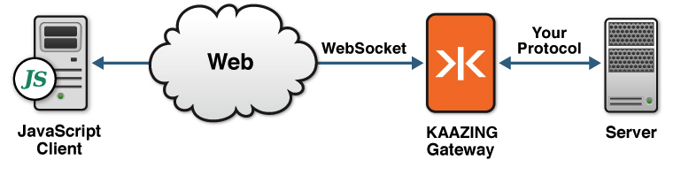

Build JavaScript WebSocket Clients
==================================

**Note:** To use the Gateway, a KAAZING client library, or a KAAZING demo, fork the repository from [kaazing.org](http://kaazing.org).

The following checklist provides the steps necessary to build clients to communicate with KAAZING Gateway or any RFC-6455 WebSocket endpoint:

| \#  | Step                                                                                                                                                               | Topic or Reference                                                                                  |
|-----|--------------------------------------------------------------------------------------------------------------------------------------------------------------------|-----------------------------------------------------------------------------------------------------|
| 1   | Learn how to use the common methods of the HTML5 WebSocket API in your client.                                                                                     | [Use the JavaScript WebSocket API](p_dev_js_websocket.md)                                         |
| 2   | Learn how to use the common methods of the HTML5 Server-Sent Events standard in your client.                                                                       | [Use the JavaScript EventSource API](p_dev_js_eventsource.md)                                     |
| 3   | Migrate your legacy KAAZING Gateway WebSocket or ByteSocket-based client to the WebSocket API-compliant libraries in KAAZING Gateway 5.0. | [Migrate JavaScript Applications to KAAZING Gateway 5.0](p_dev_js_migrate.md) |
| 4   | Implement a challenge handler in your client to respond to authentication challenges from the Gateway.                                                          | [Secure Your JavaScript Client](p_dev_js_secure.md)                                               |
| 5   | Set up logging for your client.                                                                                                                                    | [Display Logs for the JavaScript Client](p_clientlogging_js.md)                                   |

Overview of KAAZING Gateway WebSocket Library
---------------------------------------------------------------------------------

KAAZING Gateway provides support for its HTML5 Communication protocol libraries in JavaScript. Using the JavaScript client library, you can enable the HTML5 Communication protocols (for example, WebSocket and Server-Sent Events) in new or existing web applications. For example, you can create an application that uses WebSocket to get streaming financial data from a back-end server, or you can create a JavaScript client that receives streaming news data through Server-Sent Events. The following figure shows a high-level overview of the architecture:

**Figure: JavaScript client architecture overview**

KAAZING Gateway Has Full WebSocket API Compliance
------------------------------------------------------

Clients built using the KAAZING Gateway JavaScript libraries are fully-compliant with the [WebSocket API standard](http://dev.w3.org/html5/websockets/ "The WebSocket API"). All of the standards and features of the API such as sending and receiving binary using an [ArrayBuffer](http://www.khronos.org/registry/typedarray/specs/latest/ "Typed Array Specification"), ArrayBufferView, and Blob are supported. For more information, see [Supported Data Types](p_dev_js_websocket.md#supported-data-types).
